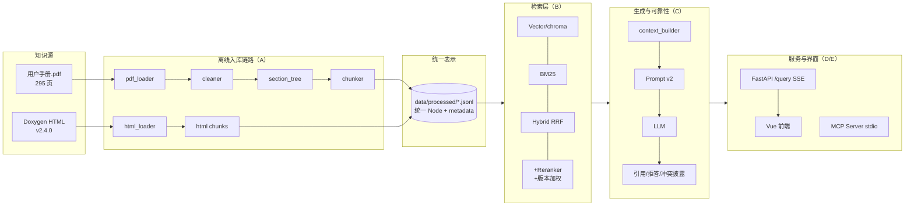
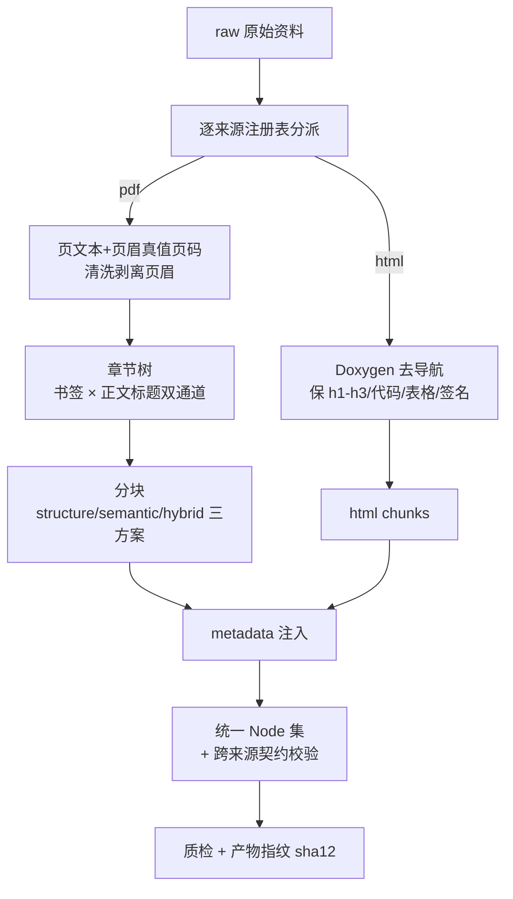
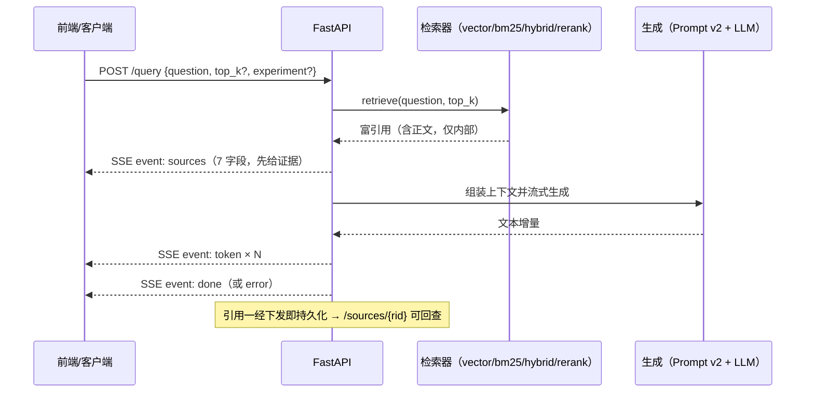

# 系统架构（成员 D）

> 版本 **v1.0（2026-09-17）**　Owner：成员 D
> 本文只描述**已实现**的形态：每个数字都可在本仓库产物或命令中复核；已知边界与未完成项集中在 §9。

## 1. 系统是什么

以《ZRDDS用户手册.pdf》（295 页）与 ZRDDS v2.4.0 Doxygen 开发文档（436 个 HTML）为知识源，
面向开发调试场景的 RAG 问答系统：**检索 → 引用溯源（双页码/来源分型）→ 有依据的回答 →
无证据拒答 → 指标化评测与回归**。

第一版刻意不做 Agent / GraphRAG / 多轮工作流，全部复杂度压在一条主线上：
**正确知识 → 正确检索 → 有依据的回答**（指南 §21）。

## 2. 模块与职责（单 Owner 制）

| 目录 | Owner | 关键落点 | 职责 |
|---|---|---|---|
| `data_pipeline/` | A | `pdf_loader` / `cleaner` / `section_tree` / `chunkers/{structure,semantic,hybrid}` / `html_loader` / `metadata.py` / `quality_check.py` | 解析、清洗、章节树、三方案分块、Metadata 单一事实源、数据质检 |
| `retrieval/` | B | `embeddings` / `vector_store`(chroma) / `bm25` / `rrf` / `rerank` / `boosts` / `retriever` / `index` | 四模式检索、RRF 融合、交叉编码器精排、版本加权、索引构建 |
| `generation/` | C | `prompts/{v0,v1,v2}` / `context_builder` / `llm` / `query_engine` / `abstention` | Prompt 版本化、上下文组装、LLM 客户端、拒答判定单一事实源 |
| `server/` `scripts/` | **D** | `server/api/*` / `core/pipeline` / `core/request_log` / `mcp_server.py`；`scripts/{ingest,build_index,run_experiment,run_regression,audit_annotations}` | 服务门面、索引生命周期、实验与回归流水线、日志设施、部署链路 |
| `web/` | E | Vue 3 + Vite 单页 | 问答界面、引用卡片、节点详情、模式选择、反馈按钮 |
| `evaluation/` | E 数据集 / C 判分 / D 报告 | `datasets/`（问题集+标注+错误案例）、`judges/`、`runners/{answer_eval,abstention_eval}`、`reports/` | 评测资产与报告 |
| `configs/experiments/` | D 定格式 | 一次实验一个 yaml（当前 13 个 + 1 模板） | 实验变量唯一入口：分块/嵌入/索引/检索/生成/评测全走配置 |

## 3. 三条运行链路

### 3.1 入库链路（离线，可重复执行）

- 多来源注册式接入：`configs` 的 `sources[]` 决定来源集，新来源放入 `data/raw/` 即可重建；
  多来源产物文件名带来源集摘要后缀（`struct_v1__b95d1061.jsonl`）。
- 跨来源校验（先校验后落盘，坏合并不覆盖好产物）：`source_id` ∈ 注册表、`version` 一致、
  双页码差值**按来源分组**、`chunk_id` 全局唯一。
- 当前产物：PDF `struct_v1` **301** 块 / HTML `html_v1` **1337** 块 / 统一多来源集 **1638** 块；
  `semantic_v1` 622、`hybrid_v1` 906（对照方案）。

### 3.2 实验与评测链路（离线）

`configs/experiments/<实验>.yaml` → `scripts/run_experiment.py`：
**索引就绪（缺失自建 / 存在复用 / `--rebuild` 强制）→ 全量题检索 → 指标 → 报告落盘**。

- 报告 schema `rag4zrdds.report/v1.1`，携带 **三指纹**（Node 集 / 问题集 / 标注集）——
  `config_hash8` 只锁配置，产物被换掉时靠指纹判定"不可比"。
- 检索指标：`hit_rate@K` / `mrr@K` / `precision@K` / `recall@K`；回答侧：`faithfulness` /
  `answer_relevance` / `correctness` / `citation_accuracy`（C 的 `answer_eval`）。
- 回归：`scripts/run_regression.py` 对历史/基准报告比对，给出四态判定
  （pass / warn / regression / incomparable）+ 退出码，可挂 CI；`--with-metrics` 为显式闸门。

### 3.3 在线服务链路

- 事件序列固定 **`sources → token×N → done`**（evidence-first）；错误双通道：流前 4xx+JSON，
  流中转 `error` 事件；每次请求一个 12 位 hex `X-Request-ID`，串联四级日志。
- 通路切换无需重启：`/query` 可选 `experiment`（白名单 = `/healthz.experiments`），
  服务端 `PipelineRegistry` 懒组装 + LRU（≤3，默认管线钉住，worker 线程组装不冻事件循环）。
- 前端支持**中止生成**：客户端 abort → 服务端捕获 `CancelledError`，把部分答案以"…（已终止）"
  留档后重新抛出，引用与 rid 仍可回查。
- 第二入口：**MCP Server**（stdio，`query_knowledge_base` / `get_sources`），与 HTTP 共用管线，
  rid 前缀 `mcp-` 区分；stdio 下一切非协议输出走 stderr。

### 3.4 HTTP 端点一览

| 端点 | 用途 |
|---|---|
| `POST /query` | 问答（SSE 流式；可选 `experiment`） |
| `GET /sources/{request_id}` | 引用明细回查（持久化，重启可查；含 `source_url`） |
| `GET /nodes/{node_id}` | 单个知识节点原文（章节路径 + 双页码 + 原文外链），跨实验按需装载 |
| `GET /documents/{source_id}/{filename}` | 本地原始 HTML 文件（白名单 + 防穿越；离线可点开原文） |
| `GET /healthz` | 存活、`mode`、`kb` 统计（索引/来源/节点数）、`experiments` 白名单与各实验检索模式 |
| `POST /feedback` | 「有帮助/无帮助」落库（未知 rid 404，不产孤儿记录） |

## 4. 知识表示与对外契约

- **Node 顶层**：`chunk_id` / `text` / `metadata` / `token_count` / `char_start` / `char_end`；
  `node_id ← chunk_id` 回退映射锁定在检索层。
- **metadata 单一事实源** `data_pipeline/metadata.py`：15 必填 + 7 可选；PDF 记**双页码**
  （`printed_page_start/end` 与 `physical_page_start/end`，印刷页 = 物理页 − 6，地面真值来自页眉解析），
  HTML 页码为 null 但 `source_url` 必填。
- **对外只下发 7 字段引用**（node_id / source_id / source_name / section / page_print / page_physical / score）：
  **chunk 正文不进 SSE wire、不进报告**——正文只出现在 `logs/`（本机）与 `GET /nodes/{node_id}`
  （定向放宽，供前端"查看原文"）。
- Citation 展示约定与 5 个待决问题见 `docs/citation-contract-draft.md`。

## 5. 关键不变量（每条都对应一次真实事故）

| 不变量 | 内容 | 由来 |
|---|---|---|
| 页码真值 | 印刷页 = 物理页 − 6（1 基物理页），页眉印刷数字为地面真值 | `+7` 方向错误事故（2026-08-29） |
| 索引身份哈希 | `hash8` 只对**索引身份段**取值（chunking / embedding / index / retrieval），改 generation/evaluation 不触发重建 | R5：C 改 prompt 版本即孤儿化三个真实索引 |
| 产物指纹 | `nodes_file_sha12` 写入 manifest，复用时硬校验；哈希前 CRLF→LF 归一 | R2/R6：产物变了配置没变 → 脏索引复用 |
| 引用制 | hybrid / hybrid_rerank 不建自有索引，经 `components` 引用既有子索引 | 避免重复编码与 25 分钟级重建 |
| 证据优先 | 先下发 sources 再出词；无证据时不猜（拒答串机读化） | 指南 §8.4 |
| 分数不可比 | vector(bge-m3 cosine) / bm25(无上界) / RRF(~0.03) / 精排(sigmoid) 量纲不同，阈值必须按 mode 定标 | X1：单一阈值 0.5 在 bm25 下静默失效 |
| 弱证据判定 | 不设绝对阈值，用「返回条数 < top_k 或空 sources」信号 | 2026-09-07 会签 |
| 索引身份段含 `retrieval.filters` | 改 filters 会派生新目录名（现有 13 个配置均未使用 filters，故零影响）；需要过滤实验时**用新实验名/新文件名**，不要改既有配置——否则旧索引目录被弃而需重建 | 2026-09-17 议题 F1 定版：维持现状（把 filters 移出身份段会使现有 6 套索引全部孤儿化，收益不抵成本） |

## 6. 可靠性与可观测

| 设施 | 落点 | 内容 |
|---|---|---|
| 请求级日志 | `logs/requests.jsonl` | rid / method / path / status / 耗时（中间件） |
| 检索级日志 | `logs/retrievals.jsonl` | 每次 `retrieve()` 一条：实验、索引、mode、top_k、延迟、`result_count`、富引用（含正文，仅本地） |
| 回答级日志 | 待接线 | 字段定义为 C 的职责，D 已拟草案 `docs/answer-log-schema.md`（v0.1，待会签） |
| 引用回查 | `logs/sources.jsonl` | rid → 引用明细持久化；**引用一经 SSE 下发即写盘**，生成失败也能回查 |
| 反馈 | `logs/feedback.jsonl` | rating(up/down) + 可选 comment/node_ids，按 rid 归因 |
| 追责串联 | `X-Request-ID` | 四级日志与 MCP 调用同 rid 关联 |

可靠性的三条硬规则落在生成侧（C）：Prompt v2 的拒答与版本差异披露、冲突披露规则、
`generation/abstention.py` 的机读拒答标记（judges / runner / 拒答专项共用）。

## 7. 评测与回归体系

- **标注闸门**：`make audit` 从 A 的产物与章节树出发核对 `expected_sources`（不调检索器），
  产出阻断项清单与"循环论证指纹"；verdict 非 pass 时**不开** `--with-metrics`（宁缺毋滥）。
- **回归四态**：`run_regression` 比对明细重合率与三指纹，给出 pass / warn / regression /
  incomparable；覆盖式写入前归档 `reports/runs/`，`--promote` 写紧凑基准锚点。
- **人工评测**：`make manual-review` 固定种子抽 30 题生成六问检查清单供人工签署（指南 §9.3）。
- **错误案例**：`collect_real_error_cases.py` 采真实报告中的无证据/脱靶/跨方案分歧案例。

## 8. 部署与运行形态

- 一键链路：`make setup`（venv + 依赖）→ `make ingest` → `make index` → `make serve`；
  另有 `experiment` / `answer-eval` / `abstention` / `manual-review` / `regression` / `audit` /
  `test` / `inspect` / `mcp` / `smoke-mcp`。
- 运行配置全部走 `.env`（不入 Git）：`RAG_MODE`、`RAG_EXPERIMENT_CONFIG`、`LLM_*`、`LOG_DIR` 等；
  进程环境变量优先于 `.env`（脚本直调时由 `run_experiment._load_dotenv()` / 服务端 `settings` 导出）。
- 索引为本机产物（`indexes/` 不入 Git）：命名 `{chunking}_{embed}_{hash8}`；重建耗时实测
  struct 301 节点约 8 分钟、多来源 1638 节点约 25 分钟（CPU + bge-m3），红线 30 分钟。
- 容器形态未交付（交付环境无 Docker），部署以 make 链路为准；离线依赖需预置 HF 权重并
  `HF_HUB_OFFLINE=1 TRANSFORMERS_OFFLINE=1`。

## 9. 已知边界

| 边界 | 说明 |
|---|---|
| 检索正式指标 | 标注整改中（`make audit` 尚因 4 题口径问题判 blocked），指标通道保持静默 |
| 回答级日志 | 字段定义待 C 回签（§6） |
| SSE 第 8 字段 | HTML 的 `source_url` 目前经回查通道下发，正式进 wire 待会签 |
| 图片与表格 | 手册 150 张截图为图片、部分表格线性化；HTML 源表格存在 `&lt;td&gt;` 转义残片（上游文档缺陷） |
| 精排成本 | `hybrid_rerank` 单题 16 秒级（CPU 精排 30 候选）；本机 120 题全量实测 **1987s ≈ 33 分钟**（2026-09-17，热态单跑），演示需预热 |

> 相关文档：`docs/api.md`（接口契约）、`docs/ingest-pipeline.md`（入库）、`docs/html-loader.md`（HTML）、
> `docs/evaluation.md`（检索方法学）、`docs/reliability-report.md`（可靠性）、
> `docs/index-rebuild-drill.md`（索引重建/回切演练）、`docs/demo-runbook.md`（演示）、
> `docs/week2|3|4-delivery-review.md`（各周交付与审查）。
